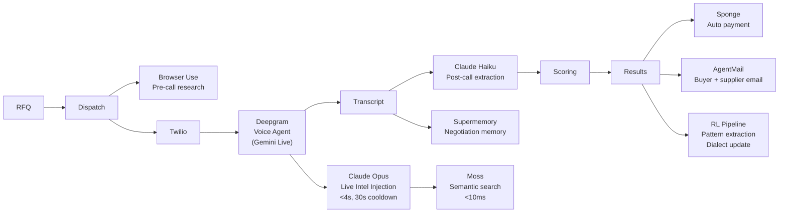

# HAGGL — Autonomous Procurement Negotiation

HAGGL dispatches AI voice agents that negotiate with suppliers in real time — with live market intelligence injected mid-call by Claude Opus.

---

## How It Works



---

## The Key Differentiator: Opus Live Injection

Claude Opus watches every supplier transcript turn in real time. When a supplier makes an unverified claim (such as an inflated lead time, false certifications, or a high price anchor), Opus fires within 2.5s to query Moss for verified market specs and Supermemory for multi-call quote histories. It then dynamically injects a powerful, context-aware counter-argument straight into the live Gemini session — completely invisible to the supplier, empowering our voice agent to counter instantly.

---

## Sponsor Integrations

| Sponsor | How Used | Where in Code |
| :--- | :--- | :--- |
| **Moss** | Semantic search for market facts and product specifications with sub-10ms response latency to substantiate mid-call negotiation counterarguments. | [moss.ts](file:///c:/Users/aritr/Downloads/YC%20Hacks%20Real/haggl/lib/sponsors/moss.ts) / [server/index.ts](file:///c:/Users/aritr/Downloads/YC%20Hacks%20Real/haggl/server/index.ts) (seed startup) |
| **Supermemory** | Persistent memory store for multi-call negotiation histories to query previous supplier quotes and context during a live call, and save transcripts after completion. | [supermemory.ts](file:///c:/Users/aritr/Downloads/YC%20Hacks%20Real/haggl/lib/sponsors/supermemory.ts) / [opusInjector.ts](file:///c:/Users/aritr/Downloads/YC%20Hacks%20Real/haggl/lib/opusInjector.ts) / [aggregator.ts](file:///c:/Users/aritr/Downloads/YC%20Hacks%20Real/haggl/lib/aggregator.ts) |
| **Browser Use** | Pre-call background web agent research targeting supplier websites to extract public quotes, certifications, and updated catalog details to seed the negotiation baseline. | [browseruse.ts](file:///c:/Users/aritr/Downloads/YC%20Hacks%20Real/haggl/lib/sponsors/browseruse.ts) / [app/api/dispatch/route.ts](file:///c:/Users/aritr/Downloads/YC%20Hacks%20Real/haggl/app/api/dispatch/route.ts) |
| **AgentMail** | Automatic post-call transactional email routing to deliver formal purchase orders to suppliers and outcome/saving metrics directly to buyers. | [agentmail.ts](file:///c:/Users/aritr/Downloads/YC%20Hacks%20Real/haggl/lib/sponsors/agentmail.ts) / [aggregator.ts](file:///c:/Users/aritr/Downloads/YC%20Hacks%20Real/haggl/lib/aggregator.ts) |
| **Sponge** | Automated multi-endpoint payout execution from virtual wallets to suppliers upon successful agreement and award. | [sponge.ts](file:///c:/Users/aritr/Downloads/YC%20Hacks%20Real/haggl/lib/sponsors/sponge.ts) / [app/api/results/route.ts](file:///c:/Users/aritr/Downloads/YC%20Hacks%20Real/haggl/app/api/results/route.ts) |
| **Stripe** | Dynamically generates secure Stripe payment links for the buyer to finalize and settle negotiated contracts instantly. | [stripe.ts](file:///c:/Users/aritr/Downloads/YC%20Hacks%20Real/haggl/lib/sponsors/stripe.ts) / [app/api/results/route.ts](file:///c:/Users/aritr/Downloads/YC%20Hacks%20Real/haggl/app/api/results/route.ts) |

---

## Numbers

- **<4s** Claude Opus live injection latency
- **30s** cooldown between mid-call intelligence injections
- **8 min** hard voice call cap
- **10** custom dialect and regional/cultural voice profiles
- **AES-256-GCM** secure buyer floor price encryption

---

## Quick Start

```bash
cp .env.example .env.local   # fill in real keys
npm install
npm run dev:all              # Next.js + Express WS bridge
```

## Scripts

| Command | Action |
| :--- | :--- |
| `npm run dev` | Next.js dev server :3000 |
| `npm run build` | Production build |
| `npm run lint` | ESLint verification |
| `npm run typecheck` | TypeScript compiler check |
| `npm run server` | Express WebSocket / Gemini bridge :3001 |
| `npm run dev:all` | Runs Next.js and Express bridge concurrently |
| `npm run db:migrate` | Runs database migrations |
| `npm run db:seed` | Seeds sample data |
